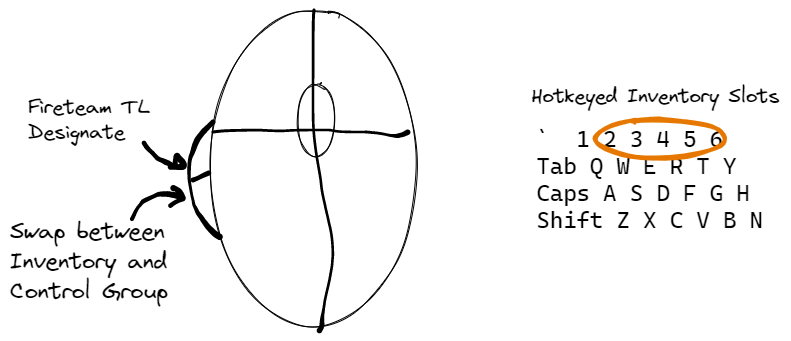
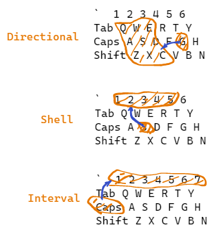
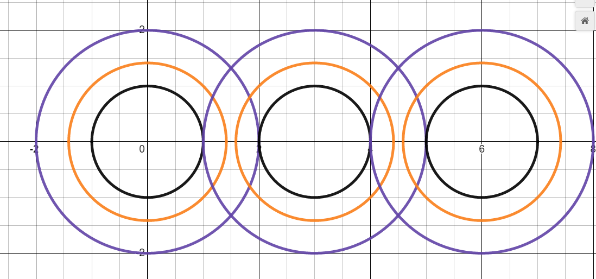

This is basically a bunch of hotkeys I've compiled to help with playing FSS and UAC in general.
# Hotkeys
## General
I've included a couple general hotkeys with this script which have been helpful but are not directly related to FSS.

1. Fireteam TL Designate is mapped to `Xbutton2`, which for me is the top button on my mouse. This simulates a middle-mouse press, which for me is very helpful since my mine is broken, but in general is a better mapping for it because you do not have to move fingers from the left or right mouse buttons.
2. <u> Inventory</u>: 
	1. Press a number key 2-6 to activate numpad 2-6. If your SC2 inventory buttons are mapped to numpad, this means that you can simulate clicking on the inventory by pressing a convenient number key.
	2. To turn Inventory Hotkeys On/Off, use the lower button on the mouse, `XButton1`
	3. The inventory hotkey's can be manually adjusted in SC2, but I disliked the idea of using an inventory system that would conflict with my control groups while playing PL.

## Shelling
These hotkeys control FSS's shelling parameters. **Shelling hotkeys are disabled when the program is started**. You can toggle them On/Off by using `ctrl+alt+s`

<u> Shell Count</u>: 
- Use `s+#` to adjust shell count. Ex: entering `s`, then `5`, would set to 5 shells.
- Use `s+s+#` to get more than 5 shells, Ex: entering `ss`, then `1` would send 6 shells, `ss`, then `2` would send 7, etc.

<u> Interval/Movespeed</u>: 
- Use `caps-lock+#` to get interval. 
- Because interval is unintuitive, I've abstracted it away. Pressing `caps+`1 gives you an interval that makes your shells move at 2.5 movespeed, and then each number greater than 1 increases it by 0.25 movespeed. Ex: `caps+7` gives 4 movespeed shells.
- For those uninitiated in the greater theory of shellonomics, most things move around 3.00 movespeed, so start there and adjust as needed.

<u> Directional</u>: 
- Press `g+{q,w,e,d,c,x,z,a,s}` to change direction
- Imagine a circle centered on the `s` key, with 0 degrees being West and 90 degrees being North. Doing `g+e` gives you a shell that moves towards 45 degrees. Doing `g+x` gives you a shell that moves towards 270 degrees. 
- `g+s` sets your direction to `-d c` and interval as fast as possible (`-i 0.2`, which lines up with movespeed of 5.0). This is unrecommended because it builds bad habits and can waste shells, but I included it because when you are shelling with 2 or less shells, direction isn't quite as important. You will have to set movespeed back manually after using circular shells.

<u> Shelling Mode</u>: 
- There are two shell modes: Tracking and Saturation. 
- To toggle between modes, press the grave key (the weird 'apostrophe' that is to the right of 1 key and above tab).
- Tracking is best suited for shelling accurately or having your shells "track" a target. This is the default
- Saturation is all about getting shells on the ground quickly to hit low HP targets and lower IL. 
	- Here is a rough Desmos graph of what saturation looks like:
	
	
	
	- The black circles represent areas where full shell damage is done, the orange is 60%, and blue is 40%
	- Basically, the radius is set so that the pattern above is gonna be right for units moving at 3.0 movespeed at a shell interval of 0.2. 
	- You can add more shells to this mode to make it longer, and adjust the direction, but changing interval has no effect.
	- Saturation is designed to be fire backwards rather than forwards, which  makes it easier to time to hit the first unit in a train of hunters/yetis/cursed/lacs.

## Understanding the Shelling Output
Every time you change a parameter, the program will send out the unified command to adjust the parameters ingame plus some additional info which may be helpful.

Shell, direction, interval, and radius should be self-explanatory at this point. The first extra thing added is the movement speed that you are set to. The second is the mode you are in (Tracking/Saturation).

# Installation
Basically there's two options:
1. Download the compiled .exe and double click it to start up the hotkey like any other program
2. If you distrust downloading the program directly, cannot use the compiled version for one reason or another, or want to edit the script yourself, you can either compile it from source or run the .ahk file directly.
	1. Either way, you will want to go grab a version of AHK at https://www.autohotkey.com/.
	2. If you are compiling, go look at the docs at https://www.autohotkey.com/docs/Scripts.htm#ahk2exe for guidance.
	3. If you want to run the scripts directly without compiling, download the source file (or copy paste it into a new script), and double click the .ahk file to run. 
